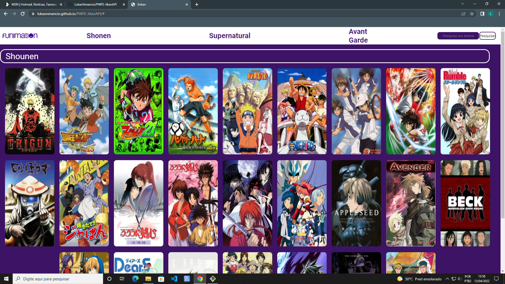

# API-JIKAN
Web site criado para demonstrar o consumo e a utilização de uma API. Atividade orientada pelo professor Fenando Leonid, na instituição [SENAI Jandira](https://jandira.sp.senai.br/)

## O que é API?
API é uma aplicação de transição entre as aplicações Front-end e Back-end, geralmente construída utilizando a tecnologia JSON.
A documentação da API utilizada pode ser acessada pelo link: [JIKAN-V4](https://docs.api.jikan.moe/)

## WebSite
O site pode ser acessado pelo link: [API-JIKAN](lukasvenancio.github.io/pwfe-jikanapi/)

## Tecnologias
* HTML5 
* CSS3
* JS
* JSON

## Observações
Ao abrir a modal, pode ocorrer uma pequena demora à atualizar os dados do anime, basta esperar alguns instantes que sejam atualizados.

## Screenshot

